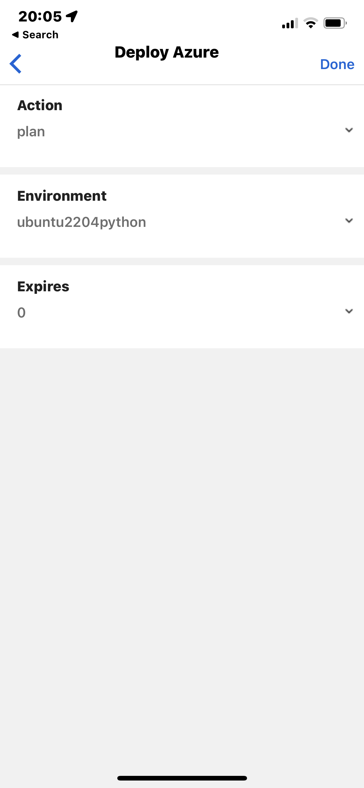

# pkcontino-subscription .

| Deployments | Automation |.  
| ----------- | ---------- |
| ✅ Single Click Environment Deployment         | ⌛️ automated, timed un-deployment|
| ✅ Ubuntu 22.04, Windows 11 Bare OS Selections | ⌛️ resource groups tagged with over-ridable expiry|
| ✅ Python 3.10 on Ubuntu                       | ⌛️ hourly scans for expired rg|

## Environment Deployment & Control

- Choose Actions
- Choose Environment Actions
- Click "Run WorkFlow" button
  - Branch              : Main
  - Choose Action       : [plan|apply|destroy]
  - Choose Environment  : [ubuntu2204|ubuntu2204python|win11]
  - Auto-Expire (Days)  : [1|2|3|4|5]

  
## Github Workflows
### Environment Actions
  - manually control actions to deploy or undeploy pre-defined environments
  - quickly spin up a default stack or create custom environments
  - all resources auto-expire and undeploy after the selected number of days 
  - expired resources are removed at the end of the day
  - selecting 0 days removes resources at 19:00 today

### Periodic Expiry
  - runs periodically without user input
  - scans for resource groups tagged with an expiry date today
  - calculates the required settings and runs terraform destroy

### Webhook for Flows
  - provides the same features to control environments via the Flows App
  - requires importing the MS Flows app and configuring
    - the connector to your github account with control over the repository
    - the owner and repository name details changing to your repository in the flow

  
  

## Required Secrets
  
